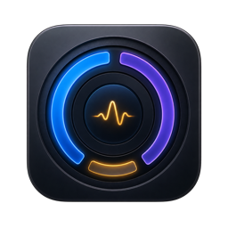

<p align="center">
  
</p>

<h1 align="center">Mac Usage Bar</h1>

<p align="center">
  <b>EN:</b> A tiny, free, ad‑free macOS menu‑bar monitor. CPU, RAM, battery, power, disk & network at a glance. &nbsp;🇬🇧<br>
  <b>PL:</b> Miniaturowy, darmowy monitor paska menu macOS — bez reklam. CPU, RAM, bateria, moc, dysk i sieć w jednym miejscu. &nbsp;🇵🇱
</p>

<p align="center">
  <a href="https://github.com/werek1773/mac-usage-bar/releases/latest"><strong>⬇ Download / Pobierz</strong></a>
  &nbsp;•&nbsp;
  <a href="#-english">English</a>
  &nbsp;•&nbsp;
  <a href="#-polski">Polski</a>
  &nbsp;•&nbsp;
  <a href="#-build-from-source--kompilacja">Build</a>
</p>

<p align="center">
  <sub>Version / Wersja: <b>1.8.4</b> (build 23) · macOS 13 Ventura+ · Apple Silicon</sub>
</p>

---

## 🇬🇧 English

A lightweight, native macOS menu‑bar app that shows live system usage. Written in a single Objective‑C file, ~900 lines, no dependencies, no telemetry, no ads — ever.

### What it shows in the menu bar
Live, monospaced readout that **adapts its width** to the available space (from a rich line down to a minimal `C42%`):

```
CPU 42%  8.3W  RAM 61%  BAT 78%  3 h 24 min
```

- Auto‑hides while a fullscreen app is frontmost (won't overlap video/games).
- Hover tooltip gives a detailed breakdown (CPU, RAM with GB used/total, power, battery).

### Click the icon → full dashboard
A frosted‑glass panel with **cards**, each refreshing every 2 seconds:

| Card | Details |
|------|---------|
| **Processor** | CPU % + thermal state (Normal / Elevated / High / Critical) + 2‑minute graph |
| **Memory (RAM)** | % used, used/total, swap, and active / wired / compressed breakdown + graph |
| **Battery & Power** | %, live power draw in **watts (W)**, charging state, time remaining, health %, cycle count |
| **Disk** | % used, used & free bytes on the startup volume |
| **Network** | Live download / upload speed |
| **Top apps** | Top 30 resource‑hungry processes, grouped by app, sortable by CPU / RAM |

### Other features
- 🪄 **Optimize** button — safely frees memory (`/usr/sbin/purge`, asks for your password once).
- 🎨 **4 themes** — Midnight, Graphite, Aurora, Liquid Glass.
- 🌐 **Two languages** — Polish & English, switchable with a live toggle.
- 🧠 Smart process names (resolves `.app` names; friendly labels for system daemons).
- 🍃 Runs as a background menu‑bar item (no Dock icon).

### Requirements
- macOS 13 (Ventura) or newer.
- **Apple Silicon (M1/M2/M3/M4)** for the prebuilt download. Intel Macs can [build from source](#-build-from-source--kompilacja).

### Install (prebuilt)
1. Go to **[Releases → latest](https://github.com/werek1773/mac-usage-bar/releases/latest)**.
2. Download `Mac.Usage.Bar.zip` and unzip it.
3. Move **Mac Usage Bar.app** to your **Applications** folder.
4. Open it (right‑click → Open the first time, since it's ad‑hoc signed — macOS will warn once).

### Privacy
100% local. No network requests, no analytics, no accounts, no ads. Everything is read from standard macOS system APIs on your machine.

---

## 🇵🇱 Polski

Lekka, natywna appka paska menu macOS pokazująca użycie systemu na żywo. Napisana w jednym pliku Objective‑C (~900 linii), bez zależności, bez telemetrii, bez reklam — nigdy.

### Co pokazuje w pasku menu
Żywy, monospaced odczyt, który **dopasowuje szerokość** do dostępnego miejsca (od pełnej linii po minimalne `C42%`):

```
CPU 42%  8.3W  RAM 61%  BAT 78%  3 h 24 min
```

- Automatycznie chowa się, gdy na pierwszym planie jest aplikacja na pełnym ekranie (nie zachodzi na wideo/gry).
- Podpowiedź (tooltip) po najechaniu pokazuje szczegółowy podział (CPU, RAM z GB zajęte/razem, moc, bateria).

### Kliknij ikonę → pełny panel
Panel z efektem szkła i **kartami**, odświeżanymi co 2 sekundy:

| Karta | Szczegóły |
|-------|-----------|
| **Procesor** | CPU % + stan termiczny (Normalny / Podwyższony / Wysoki / Krytyczny) + wykres 2‑minutowy |
| **Pamięć RAM** | % zajętości, zajęte/razem, swap oraz podział aktywna / przewodowa / skompresowana + wykres |
| **Bateria i moc** | %, aktualny pobór mocy w **watach (W)**, stan ładowania, czas do rozładowania, kondycja %, liczba cykli |
| **Dysk** | % zajętości, zajęte i wolne bajty na wolumenie startowym |
| **Sieć** | Prędkość pobierania / wysyłania na żywo |
| **Top aplikacje** | 30 najbardziej obciążających procesów, zgrupowanych po aplikacji, sortowanie CPU / RAM |

### Inne funkcje
- 🪄 Przycisk **Optymalizuj** — bezpiecznie zwalnia pamięć (`/usr/sbin/purge`, raz pyta o hasło).
- 🎨 **4 motywy** — Midnight, Graphite, Aurora, Liquid Glass.
- 🌐 **Dwa języki** — polski i angielski, przełączane animowanym suwakiem.
- 🧠 Mądre nazwy procesów (rozpoznaje nazwy `.app`; przyjazne etykiety demonów systemowych).
- 🍃 Działa jako element paska menu w tle (bez ikony w Docku).

### Wymagania
- macOS 13 (Ventura) lub nowszy.
- **Apple Silicon (M1/M2/M3/M4)** dla gotowego pobrania. Maca z procesorem Intela można [zbudować ze źródeł](#-build-from-source--kompilacja).

### Instalacja (gotowa appka)
1. Wejdź w **[Releases → najnowsza](https://github.com/werek1773/mac-usage-bar/releases/latest)**.
2. Pobierz `Mac.Usage.Bar.zip` i rozpakuj.
3. Przenieś **Mac Usage Bar.app** do folderu **Aplikacje**.
4. Uruchom (pierwszy raz: kliknij prawym → Otwórz, bo appka jest podpisana ad‑hoc — macOS ostrzeże raz).

### Prywatność
100% lokalnie. Żadnych zapytań sieciowych, analityki, kont ani reklam. Wszystko odczytywane ze standardowych API systemu macOS na Twoim komputerze.

---

## 🔧 Build from source / Kompilacja

You only need the Xcode Command Line Tools (`xcode-select --install`).

```bash
git clone https://github.com/werek1773/mac-usage-bar.git
cd mac-usage-bar/MacUsageBar
./build.sh
```

The script compiles `main.m` with `clang` and outputs the signed `.app` bundle to `../build/Mac Usage Bar.app`.

> Building from source produces a **universal/native binary for your Mac** — so Intel users get an Intel build automatically.

---

## 📦 Releases / Wydania

Prebuilt binaries are attached to each [GitHub Release](https://github.com/werek1773/mac-usage-bar/releases). The `build/` folder is intentionally not committed — source code lives in the repo, the ready‑to‑run app lives in Releases.

## 🤝 Contributing / Współpraca

Bug reports and pull requests welcome at the [Issues page](https://github.com/werek1773/mac-usage-bar/issues).

## 📄 License / Licencja

[MIT](LICENSE) — free to use, modify, and share. Darmowe do używania, modyfikacji i udostępniania.
